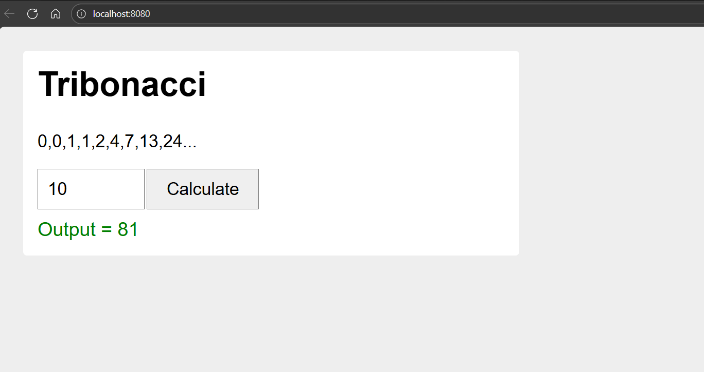

# Web-Assembly
This repository contains the WebAssembly task for my Master’s degree.

# tribonacci wasm

just trying out webassembly here. made a simple tribonacci function in c++ and got it running in browser

## whats tribonacci

its like fibonacci but u add 3 numbers not 2
```
0, 0, 1, 1, 2, 4, 7, 13, 24...
```

## how to run it

u need emscripten first:
```
git clone https://github.com/emscripten-core/emsdk.git
cd emsdk
./emsdk install latest
./emsdk activate latest
source ./emsdk_env.sh
```

then complie and run:
```
cd webassembly
emcc tribonacci.cpp -o tribonacci.js -s EXPORTED_FUNCTIONS='["_tribonacci"]' -s EXPORTED_RUNTIME_METHODS='["ccall"]'
python3 -m http.server 8080
```

go to http://localhost:8080

## output



## files

- tribonacci.cpp - the c++ code
- index.html - webpage
- tribonacci.js - emscripten genrated this dont touch it
- tribonacci.wasm - compiled stuff
